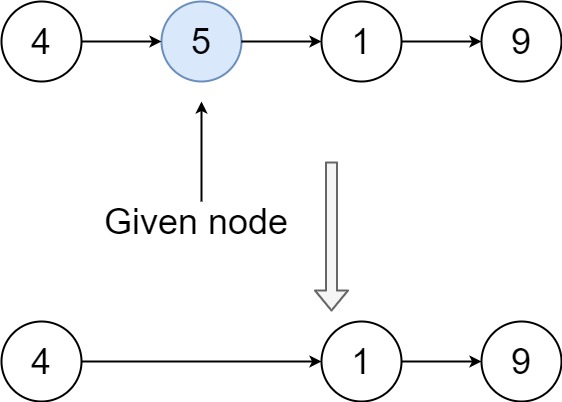

# Linkedlist:

## Challenge01 - Delete Node:

Write a function to <strong>delete a node</strong> in a singly-linked list. You will <strong>not</strong> be given access to the <code>head</code> of the list, instead you will be given access to <strong>the node to be deleted</strong> directly.

It is <strong>guaranteed</strong> that the node to be deleted is <strong>not a tail node</strong> in the list.

&nbsp;

<strong>Example 1:</strong>

<pre><strong>Input:</strong> head = [4,5,1,9], node = 5
<strong>Output:</strong> [4,1,9]
<strong>Explanation: </strong>You are given the second node with value 5, the linked list should become 4 -&gt; 1 -&gt; 9 after calling your function.
</pre>

<strong>Example 2:</strong>

<pre><strong>Input:</strong> head = [4,5,1,9], node = 1
<strong>Output:</strong> [4,5,9]
<strong>Explanation: </strong>You are given the third node with value 1, the linked list should become 4 -&gt; 5 -&gt; 9 after calling your function.
</pre>

&nbsp;

<strong>Constraints:</strong>

<ul>
	<li>The number of the nodes in the given list is in the range <code>[2, 1000]</code>.</li>
	<li><code>-1000 &lt;= Node.val &lt;= 1000</code></li>
	<li>The value of each node in the list is <strong>unique</strong>.</li>
	<li>The <code>node</code> to be deleted is <strong>in the list</strong> and is <strong>not a tail</strong> node</li>
</ul>

## Instruction:

### Language: `JavaScript`:

* Create a branch called `ll_delete_node`.
* Run this command to pull the code challenge question: `npm run pull-challenge linkedlist 01`
* Navigate to the challenge folder: `code-challenges/linkedlist/challenge01`
* Write your solution in `challenge01.js` file.
* Write your tests in `challenges01.test.js` file.
* Document your work along with an image of your whiteboard in the `whiteboard.md` file.
* To run your test: `npm test`

## Language: `Python`:

* Create a branch called `ll_delete_node`.
* Run this command to pull the code challenge question: `python pull.py linkedlist 01`
* Navigate to the challenge folder: `code_challenges/linkedlist/challenge01`
* Write your solution in `challenge01.py` file.
* Write your tests in `test_challenges01.py` file.
* Document your work along with an image of your whiteboard in the `whiteboard.md` file.
* To run your test: `pytest`

## Submission:
* ACP your work once you are done.
* Create a pull request from your branch to the `main` branch
* Copy the link to your open pull request and paste it into the assignment submission field.
* Leave a description of how long this assignment took you in the comments box.
* Add any additional comments to your grader about your process or any difficulties you may have had with the assignment.
* Merge your branch into main, and delete your branch (don't worry, the PR link will still work).